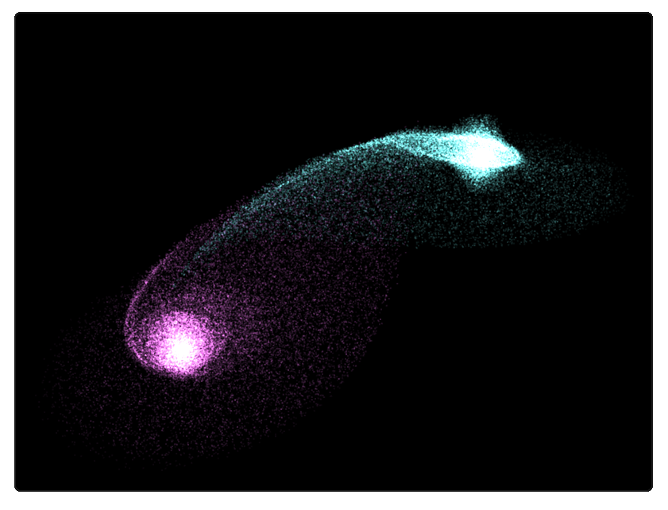

# Two Galaxies

This project shows a simulation of two galaxies affected by each other's gravity.

This is a WebGL programming example in the "from scratch" style - the physics model and numerical algorithms used in the simulation are screen-saver quality.

Try it here: **https://tkoster.github.io/galaxies-js**

## Usage

The viewpoint can be moved interactively by clicking and dragging the mouse over the canvas. Use the mouse wheel to change the viewing distance.

## Implementation Notes

This project is a web programming example in the "from scratch" style.

The differential equation solver and linear algebra functions are written in JavaScript using `Float32Array` buffers. No JavaScript libraries are used. WebGL is used to render the stars on the canvas.

The following browser APIs are used:
- [Document Object Model](https://developer.mozilla.org/en-US/docs/Web/API/Document_Object_Model)
- [Pointer Events](https://developer.mozilla.org/en-US/docs/Web/API/Pointer_events) and the [Pointer Lock API](https://developer.mozilla.org/en-US/docs/Web/API/Pointer_Lock_API) to implement click-and-drag
- [WebGL](https://developer.mozilla.org/en-US/docs/Web/API/WebGL_API)

